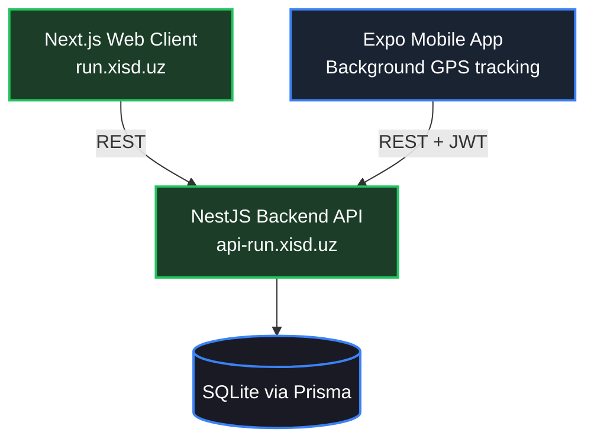

# 🏃 RunApp — Run, Compete, Win

RunApp is a public, gamified running tracker: log runs, climb daily/weekly/all-time leaderboards, and track your stats (distance, average speed, max speed, streaks). It ships as a web app (dashboard + leaderboard + profile) and a native mobile app (Expo/React Native) that records runs via GPS — including in the background, while your phone is locked.

## 🏗️ Architecture



## ⚡ Tech Stack

| Layer | Technology |
| :--- | :--- |
| Backend | NestJS, Prisma, SQLite, JWT auth |
| Web | Next.js 16 (App Router), Tailwind v4 |
| Mobile | Expo (React Native), `@expo/vector-icons`, `expo-location` (background GPS) |
| Deploy | PM2 + nginx + certbot, GitHub Actions auto-deploy |

## 🎮 Features

- Open registration — anyone can sign up and start running.
- Gamified points per run (`round(distance / 100m) + streak bonus`), daily login/run streaks.
- Daily / Weekly / All-time leaderboards.
- Per-user stats: total distance, total points, average speed, best max speed, streaks.
- Profile: avatar upload, username, password change.

## 🚀 Getting Started

### Backend
```bash
cd backend
npm install
# create backend/.env (git-ignored):
#   DATABASE_URL="file:./dev.db"
#   JWT_SECRET="<generate a long random string>"
#   PORT=4000
npx prisma migrate dev
npm run start:dev
```

### Frontend
```bash
cd frontend
npm install
# .env.local: NEXT_PUBLIC_API_URL=http://localhost:4000
npm run dev
```

### Mobile
```bash
cd mobile
npm install
npx expo start
```

## 📦 Deploy

Same pattern as this project's sibling app (Symphony): PM2 (`ecosystem.config.js`) + nginx + certbot on the server, with GitHub Actions auto-deploying on push to `main` via a restricted SSH deploy key (`.github/workflows/deploy.yml` for web, `build-apk.yml` for the mobile APK).
